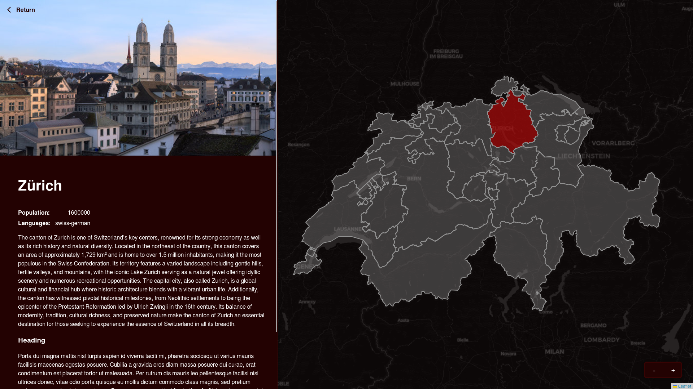
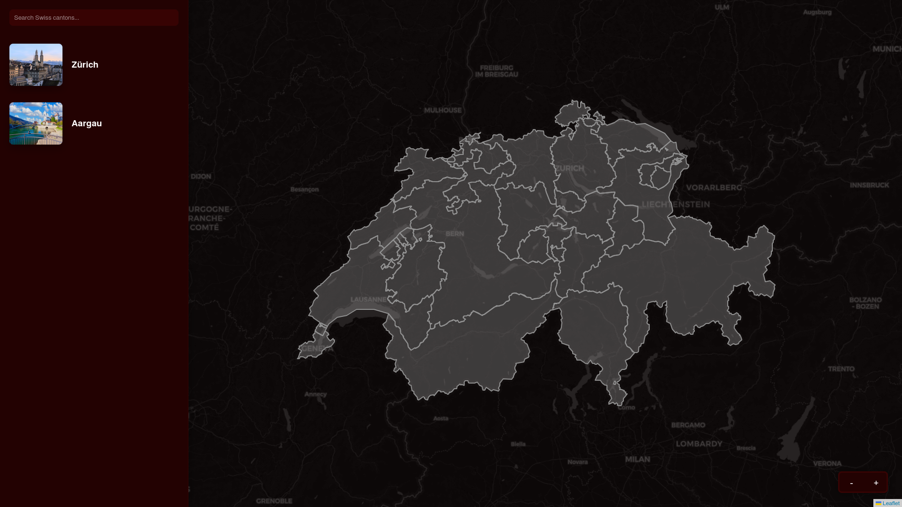
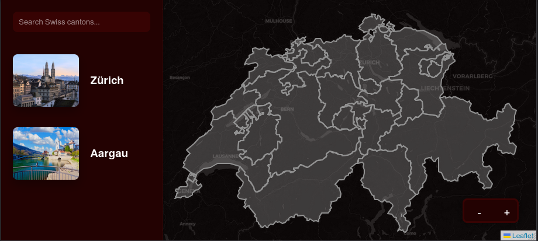

# swiss-stats

A simple web application made with React (TypeScript) that shows general information about Switzerland and its cantons.

**Note:** This project is still under development, there are bugs and uncompleted features.

### Features
* Responsive design (on mobiles, landscape orientation is mandatory).
* Light and dark mode
* Interactive Switzerland map

### Development status

The project is fully functional and extensible. It lacks all the canton information yet. Also, a language selector may be implemented in the future, allowing to see the content in English, Spanish, German or French.

### Screenshots

